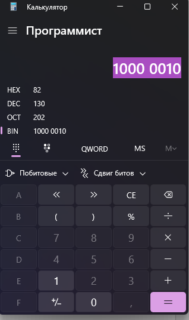

# Самостоятельная работа по компьютерным сетям

## Часть A. Теоретические вопросы (краткий ответ)

1. Дайте определение компьютерной сети.

    Это связанные устройства, которые могут обменивается данными и используют общие ресурсы.

2. Перечислите основные топологии сетей (не менее трёх).

    Кольцо, шина, звезда.

3. Чем отличается локальная сеть (LAN) от глобальной (WAN)?

    Lan охватывает только небольшие территории, а wan является глобальный может объединять огромные расстояния.

4. Сколько уровней в модели OSI? Назовите их по порядку (снизу вверх).

    7)Физический, канальный, сетевой, транспортный, сеансовый, представления, прикладной.

5. На каком уровне модели OSI работает коммутатор (switch), а на каком — маршрутизатор (router)?

    Коммутатор на канальном, роутер на сетевом

6. Сколько уровней в модели TCP/IP? Перечислите их.

    4 уровня. Сетевой доступ, межсетевой, транспортный, прикладной.

7. Сопоставьте уровни OSI и TCP/IP (укажите соответствие).

    OSI 1-2 сетевой доступ. 3- межсетевой, 4 – транспортный, 5-7 -прикладной.

8. Какой протокол работает на транспортном уровне и обеспечивает надёжную доставку с установлением соединения?

    TCP

9. Какой протокол транспортного уровня не гарантирует доставку, но работает быстрее?

    UDP

10. Что такое MAC-адрес и на каком уровне модели OSI он используется?

    Адрес сетевого интерфейса устройства, используется на канальном уровне.

11. Какова длина MAC-адреса в битах и байтах? Как он обычно записывается?

    6 байт, записывается в 16-ситеме к примеру 00: 1A : 2B: 3C : 4D : 5E

## Часть B. IPv4

12. Запишите IP-адрес 192.168.10.130 в двоичном виде.

    На калькуляторе

    

    11000000.10101000.00001010.10000010

13. Определите класс IP-адреса 172.16.5.10.

    Клас B из-за диапазона 128-191

14. Является ли адрес 192.168.1.1 частным (приватным)? Ответ обоснуйте.

    Да, ведь он входит в диапазон частных сетей

15. Для адреса 192.168.1.0/24 укажите: маску подсети в десятичном виде; количество доступных адресов для хостов; адрес сети; широковещательный адрес (broadcast).

    Маска: 255.255.255.0; количество доступных адресов для хостов: 254; адрес сети: 192.168.1.0; broadcast: 192.168.1.255.

16. Для адреса 10.0.0.0/30: сколько всего адресов в подсети? Сколько из них пригодны для устройств?

    Всего адресов: 4; пригодны для устройств: 2.

17. Что такое шлюз по умолчанию (default gateway) и зачем он нужен?

    Маршрутизатор, которому передаются пакеты, если нет конкретного маршрута.

## Часть C. MAC-адреса

18. Определите, какие из приведённых записей являются корректными MAC-адресами. Для некорректных укажите причину: а) 00:1A:2B:3C:4D:5E; б) 00-1A-2B-3C-4D-5E; в) 001A.2B3C.4D5E; г) 00:1A:2B:3C:4D; д) 00:1A:2B:3C:4D:5E:6F; е) 0G:1A:2B:3C:4D:5E.

    а) Правильно; б) разделение не то; в) разделение не то; г) не хватает 2 битов; д) 7 бит; е) g не существует в 16.

19. MAC-адрес устройства: A4:5E:60:12:34:56. Определите: OUI (идентификатор производителя) — первые 3 байта; NIC (идентификатор устройства) — последние 3 байта; является ли адрес unicast или multicast (по значению младшего бита первого байта).

    OUI: A4:5E:60; NIC: 12:34:56; unicast.

20. Что такое широковещательный MAC-адрес? Запишите его.

    FF:FF:FF:FF:FF:FF обозначает всех получателей

21. Чем отличается MAC-адрес от IP-адреса? Укажите не менее трёх отличий.

    Имеют разные уровни, у MAC – 48бит у ipv4 -32 бит, разный формат записи.

22. Как коммутатор (switch) использует MAC-адреса для передачи кадров? Что такое таблица MAC-адресов?

## Часть D. Маршрутизация

23. Что такое маршрутизация? Какую функцию выполняет маршрутизатор?

    Выбор пути доставки, Выбирает маршрут и пересылает пакет.

24. Что содержит таблица маршрутизации? Назовите минимум три поля.

    Сеть назначения, маска, следующий узел, выходной интерфейс, метрика

25. Дана таблица маршрутизации (ниже). Куда будет отправлен пакет с адресом назначения: а) 192.168.1.55? б) 10.5.5.5? в) 8.8.8.8?

    а) Fa0/0; б) Fa0/1; в) Fa0/2.

    | Сеть назначения | Маска | Интерфейс |
    | --- | --- | --- |
    | 192.168.1.0 | 255.255.255.0 | Fa0/0 |
    | 10.0.0.0 | 255.0.0.0 | Fa0/1 |
    | 0.0.0.0 | 0.0.0.0 | Fa0/2 |

26. Объясните принцип «самого длинного префикса» (longest prefix match) при выборе маршрута.

    Выбирается самый конкретный

27. Что такое статическая и динамическая маршрутизация? Приведите пример протокола динамической маршрутизации.

    Статическая задаётся вручную, динамическая выдаётся автоматически и обновляется.

## Часть E. Практическое задание

28. Дана сеть 172.16.0.0/16. Требуется разделить её на подсети так, чтобы в каждой было не менее 500 хостов. Определите: новую маску подсети; количество подсетей; адрес первой подсети (сеть, первый и последний хост, broadcast).

29. Опишите путь данных при отправке HTTP-запроса с компьютера на сервер, указав, какие уровни OSI/TCP/IP и какие протоколы задействованы на каждом этапе (инкапсуляция). Отдельно отметьте, где используются MAC-адреса, а где — IP-адреса.
