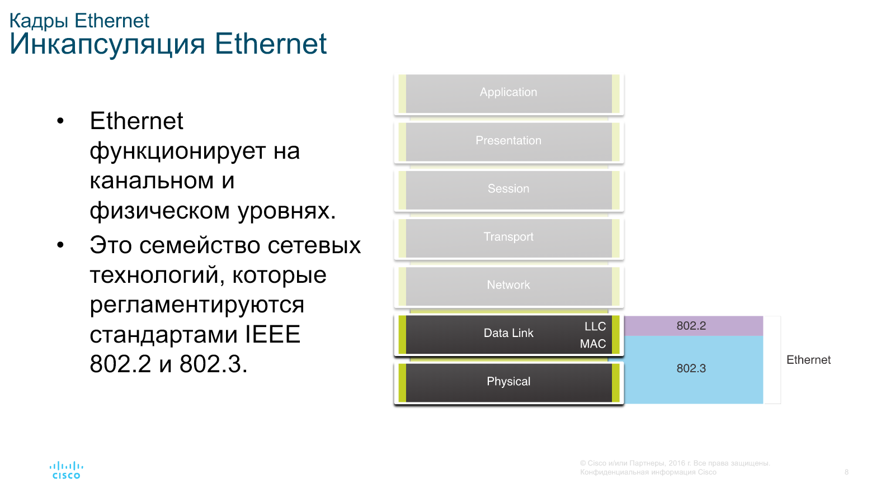
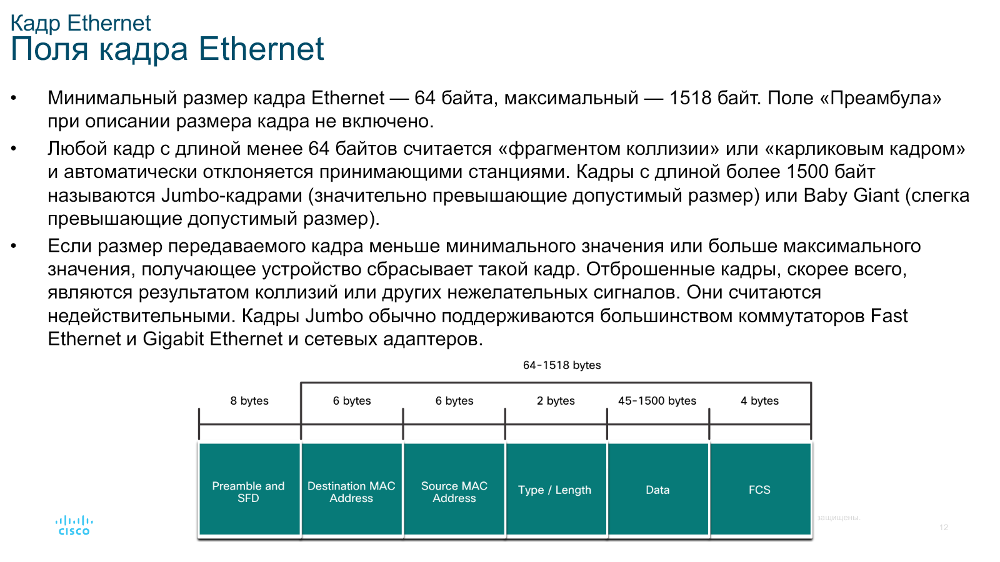
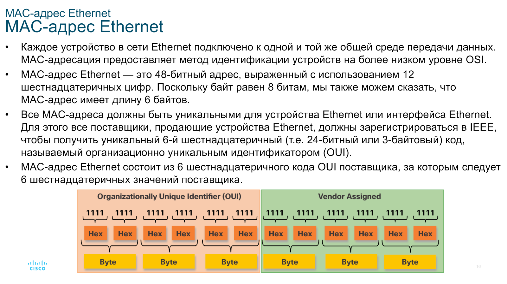
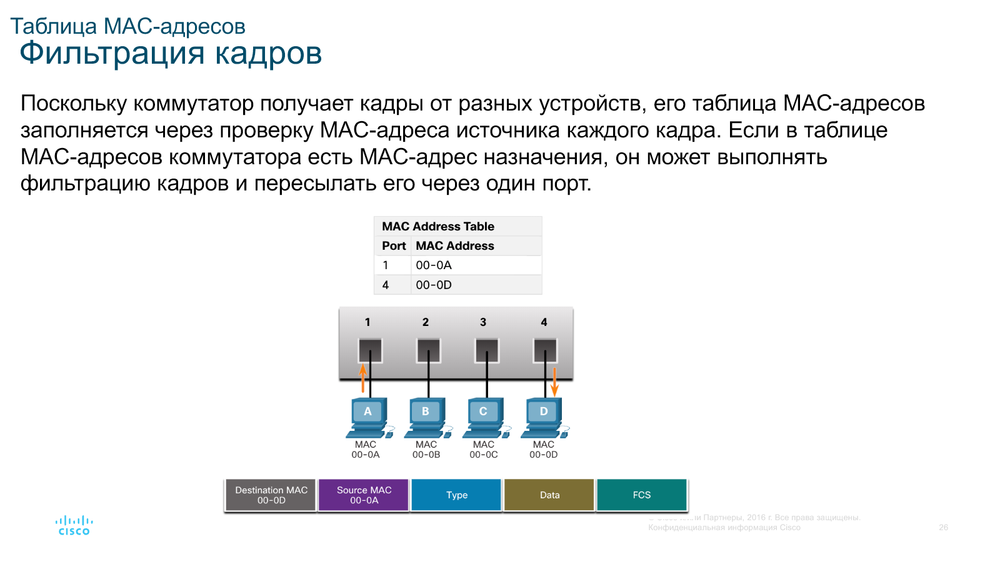
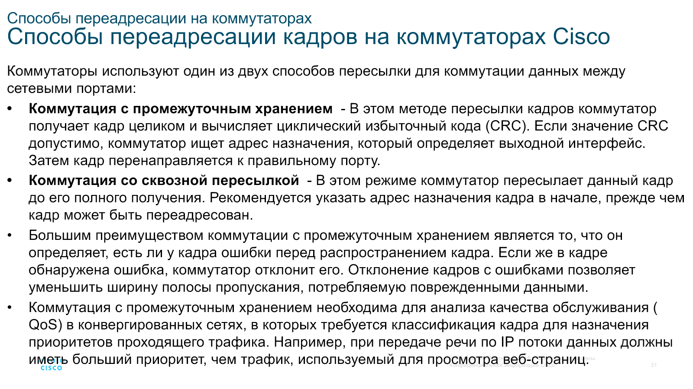
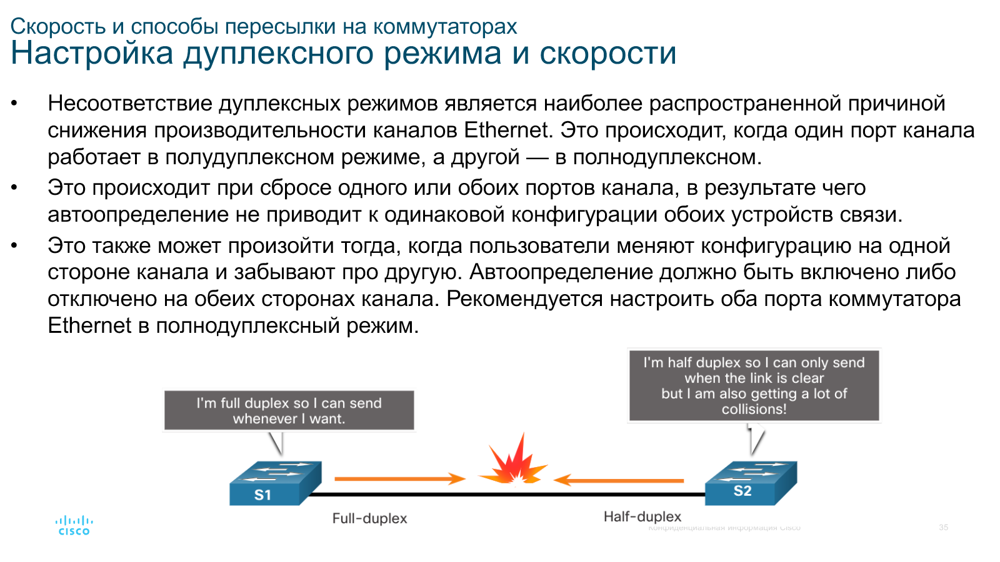

# Коммутация Ethernet

Цель модуля — объяснить, как работает Ethernet в коммутируемой сети.

## Ethernet и кадр

- Ethernet работает на физическом и канальном уровнях и регламентируется стандартами IEEE 802.2 и 802.3.
- Подуровень LLC указывает протокол сетевого уровня.
- Подуровень MAC отвечает за инкапсуляцию, адресацию и доступ к среде передачи данных.
- В современных коммутируемых сетях используется полнодуплексный режим, которому не требуется CSMA/CD.

### Поля кадра Ethernet

- Преамбула и начальный разделитель кадра.
- MAC-адрес назначения и MAC-адрес источника.
- Тип или длина, данные и FCS. Поле FCS используется для обнаружения ошибок.
- Размер кадра составляет от 64 до 1518 байт без учёта преамбулы. Кадры недопустимого размера отбрасываются.

## MAC-адрес Ethernet

- MAC-адрес содержит 48 бит, или 6 байт, и записывается 12 шестнадцатеричными цифрами.
- Первые 24 бита образуют уникальный идентификатор организации OUI. Оставшуюся часть назначает поставщик.
- Сетевая плата сравнивает MAC-адрес назначения со своим адресом. Она также принимает широковещательные кадры и кадры групповой рассылки, в которую входит узел.

### Виды MAC-адресов

- **Индивидуальный:** адрес одного устройства. MAC-адрес источника всегда индивидуальный.
- **Широковещательный:** `FF-FF-FF-FF-FF-FF`. Коммутатор отправляет кадр через все порты, кроме входящего. Маршрутизатор его не пересылает.
- **Групповой:** для IPv4 начинается с `01-00-5E`, для IPv6 — с `33-33`. Такой кадр получает группа устройств.

## Таблица MAC-адресов

- Коммутатор уровня 2 принимает решение о пересылке только по MAC-адресам Ethernet.
- После включения таблица пуста. Коммутатор изучает MAC-адрес источника каждого кадра и связывает его с входящим портом.
- Если запись уже существует, обновляется её таймер. По умолчанию запись хранится 5 минут. При появлении адреса на другом порту запись заменяется.
- Известный адрес назначения отправляется через указанный порт. Неизвестный индивидуальный, широковещательный или групповой адрес пересылается через все порты, кроме входящего.
- Таблицу MAC-адресов также называют CAM-таблицей.

## Способы пересылки

- **С промежуточным хранением:** коммутатор получает весь кадр, проверяет CRC и отбрасывает кадры с ошибками. Этот способ нужен для анализа QoS.
- **Сквозная:** пересылка начинается до получения кадра целиком, после чтения MAC-адреса назначения. Ошибки кадра не проверяются.
- **Быстрая пересылка:** вариант сквозной коммутации с минимальной задержкой.
- **С исключением фрагментов:** перед пересылкой коммутатор проверяет первые 64 байта кадра.

## Буферизация

- При буферизации на основе портов кадры хранятся в очередях входящих и исходящих портов. Занятый порт назначения может задержать остальные кадры очереди.
- При совместно используемой памяти все кадры находятся в общем буфере. Память распределяется между портами динамически, что полезно при разных скоростях портов.

## Дуплексный режим, скорость и Auto-MDIX

- В полнодуплексном режиме данные одновременно передаются в обе стороны. В полудуплексном режиме отправляет только одна сторона.
- Автоопределение позволяет устройствам согласовать скорость и дуплексный режим. Порты Gigabit Ethernet работают только в полнодуплексном режиме.
- Несоответствие дуплексных режимов снижает производительность. Настройки автоопределения должны совпадать на обеих сторонах канала.
- Auto-MDIX определяет тип подключённого кабеля и настраивает интерфейс. Функцию можно включить командой `mdix auto`.

