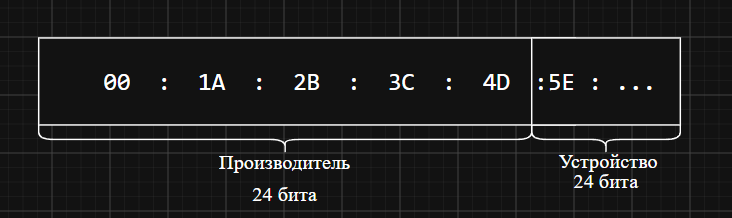
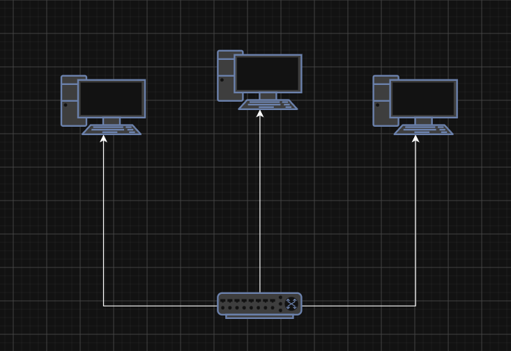

# Домашнее задание к уроку 3

## Что надо было сделать

- Вам потребуется создать схему mac-адреса
- в дополнение к этому нарисуйте схему соединения компьютеров с коммутаторов и распишите ситуация когда может возникнуть ошибка и как исправить.

## Решение

Схема mac-адреса

Схема соединения компьютеров с коммутаторов

| Ситуация                           | Ошибка                                                      | Исправление                                                       |
| ---------------------------------- | ----------------------------------------------------------- | ----------------------------------------------------------------- |
| Индикатор порта  не горит       | Кабель повреждён,  порт или сетевая карта не работают | Переподключить  или заменить кабель,  включить оборудование |
| Компьютеры  не видят друг друга | Разные IP-подсети  или VLAN                              | Проверить IP-адреса, маски и  назначить портам один VLAN       |
| Сеть работает медленно             | Не совпадают скорость или дуплекс                        | Включить автоопределение,  установить одинаковые параметры     |

