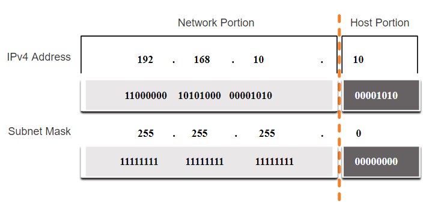
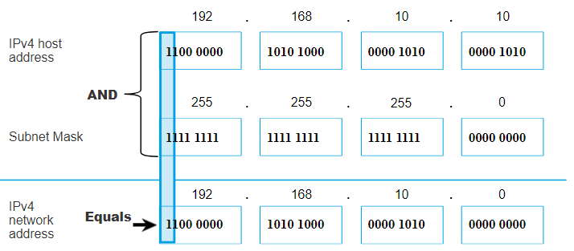
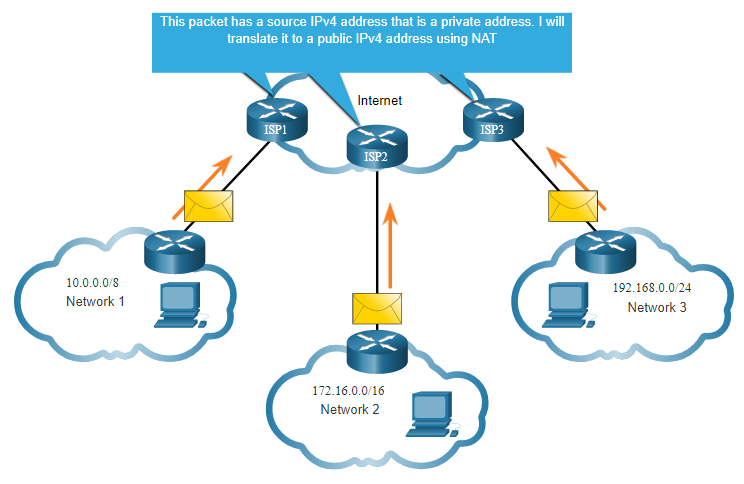
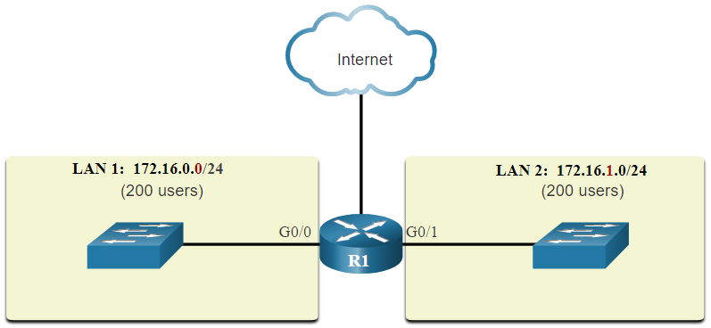
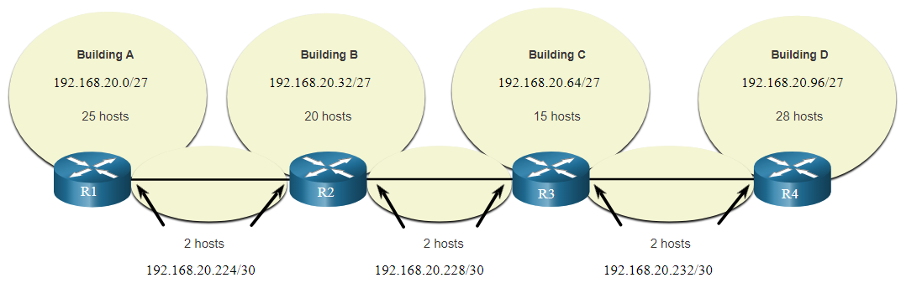

# IPv4: адресация и подсети

## Адрес и маска

- IPv4-адрес состоит из 32 бит (четырёх октетов). Маска делит его на часть сети и часть узла.
- Префикс показывает число бит сети: `/24` соответствует маске `255.255.255.0`.
- Адрес сети получают побитовой операцией **И** между адресом узла и маской. Например, для `192.168.10.10/24` адрес сети — `192.168.10.0`.
- В этой сети `192.168.10.255` — широковещательный адрес, а узлам доступны адреса от `192.168.10.1` до `192.168.10.254`.

## Способы передачи

- **Одноадресная:** пакет отправляется одному устройству.
- **Широковещательная:** пакет получают все узлы в пределах широковещательного домена.
- **Многоадресная:** пакет получает группа устройств, например по адресу `224.10.10.5`.

## Публичные и частные адреса

- Публичный адрес используется для маршрутизации в Интернете. Частный адрес предназначен для внутренних сетей и напрямую в Интернете не маршрутизируется.
- Частные диапазоны: `10.0.0.0/8`, `172.16.0.0/12`, `192.168.0.0/16`. Для выхода устройств с частными адресами в Интернет обычно используют NAT.
- `127.0.0.1` проверяет сетевой стек самого устройства; адреса `169.254.0.0/16` могут назначаться автоматически, когда DHCP недоступен.
- Старое деление адресов на классы A, B и C заменено адресацией с префиксами.

## Разделение на подсети

- Большую сеть делят на подсети, чтобы ограничить широковещательный трафик. Маршрутизатор отделяет один широковещательный домен от другого.
- Чем длиннее префикс, тем меньше адресов узлов в подсети. Сеть `/24` можно разделить на четыре подсети `/26`: каждая содержит по 62 обычных адреса узлов.
- Для обычной подсети число адресов узлов считают так: `2^(32 − длина префикса) − 2`. Два адреса отводятся под адрес сети и широковещательный адрес.

## VLSM и планирование адресов

- **VLSM** позволяет использовать подсети разного размера: например, `/27` для сети до 30 узлов и `/30` для канала между двумя маршрутизаторами. Это экономит адреса.
- Подсети распределяют от самой большой потребности в узлах к самой маленькой.
- Перед настройкой считают количество подсетей и узлов. Клиентам адреса обычно выдаёт DHCP, а серверам и сетевым устройствам назначают постоянные адреса.

