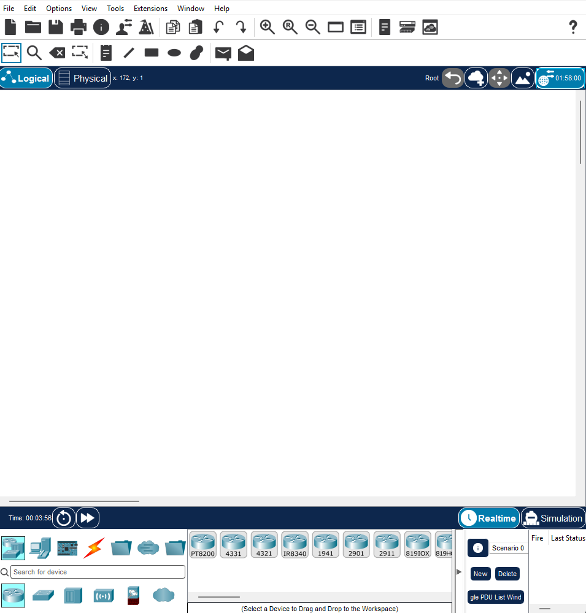

# Домашние задание № 5

## Что надо было сделать 

- Вам потребуется скачать циско и прислать открытую работающую программу. 

- Вам потребуется распределить 127.168 /24 IP адрес на подсети где 5 зданий с маршрутами и в каждом от 15 до 25 устройств.Найдите нужную длину для /* для 20 подсетей и 10 узлов

## Решение

Скриншот програмы: 

Распределение: 
 
Исходная сеть **127.168.0.0/24**.

Для каждого здания: **/27**, маска **255.255.255.224**, 30 адресов узлов (включая маршрутизатор).

| Здание | Подсеть          | Маршрутизатор | Адреса устройств            |
| ------ | ---------------- | ------------- | --------------------------- |
| 1      | 127.168.0.0/27   | 127.168.0.1   | 127.168.0.2–127.168.0.30    |
| 2      | 127.168.0.32/27  | 127.168.0.33  | 127.168.0.34–127.168.0.62   |
| 3      | 127.168.0.64/27  | 127.168.0.65  | 127.168.0.66–127.168.0.94   |
| 4      | 127.168.0.96/27  | 127.168.0.97  | 127.168.0.98–127.168.0.126  |
| 5      | 127.168.0.128/27 | 127.168.0.129 | 127.168.0.130–127.168.0.158 |

Для **10 узлов** нужна **/28**: 2⁴ − 2 = 14 адресов узлов.

В исходной **/24** получится только 2⁴ = **16 подсетей /28**. 

Ответ: Для **20 подсетей по 10 узлов** нужна исходная сеть минимум **/23** (32 подсети /28).

