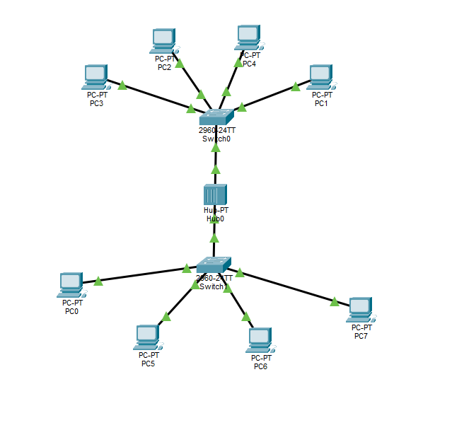
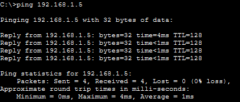
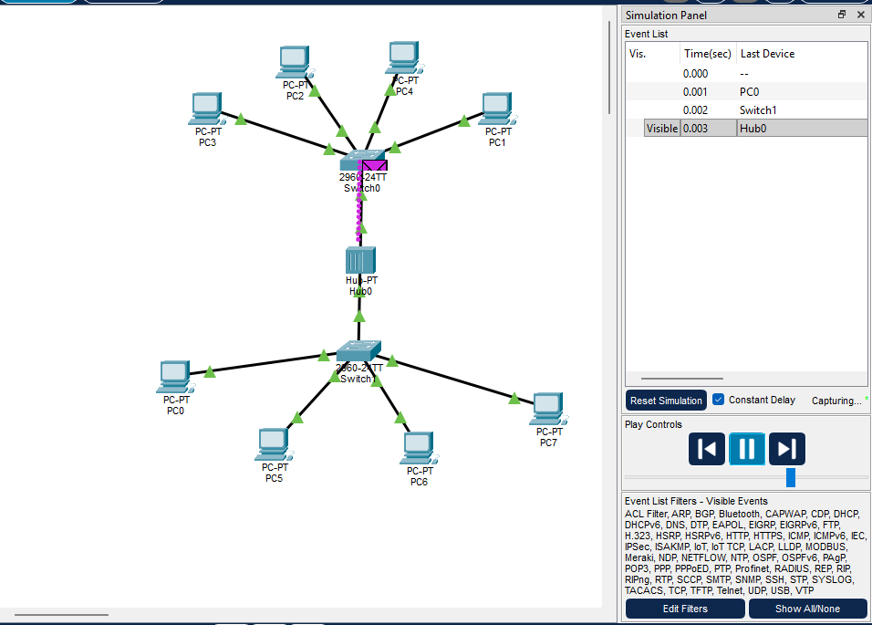

# Домашние задание № 6

## Что надо было сделать

- Вам потребуется построить сеть в циско с 8 компьютераи 2 комутаторами и 1 хабом

- в дз присылаете ссылку на гитхаб где у вас 3 фото на 1 схема на втором консольный ping,  на 3 работа симулятора по отправки пинга.

## Решение

1. Скриншот схемы сети 

2. Скриншот консоли с результатами ping 

3. Скриншот работы симулятора по отправки пинга 

Файл со схмеой сети [Cisco-Network-create.pkt](../../.github/pkt/lesson_06/Cisco-Network-1.pkt)
