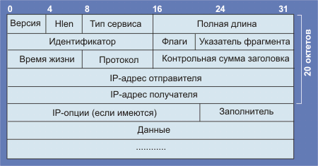
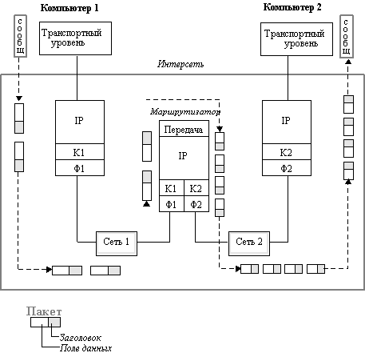
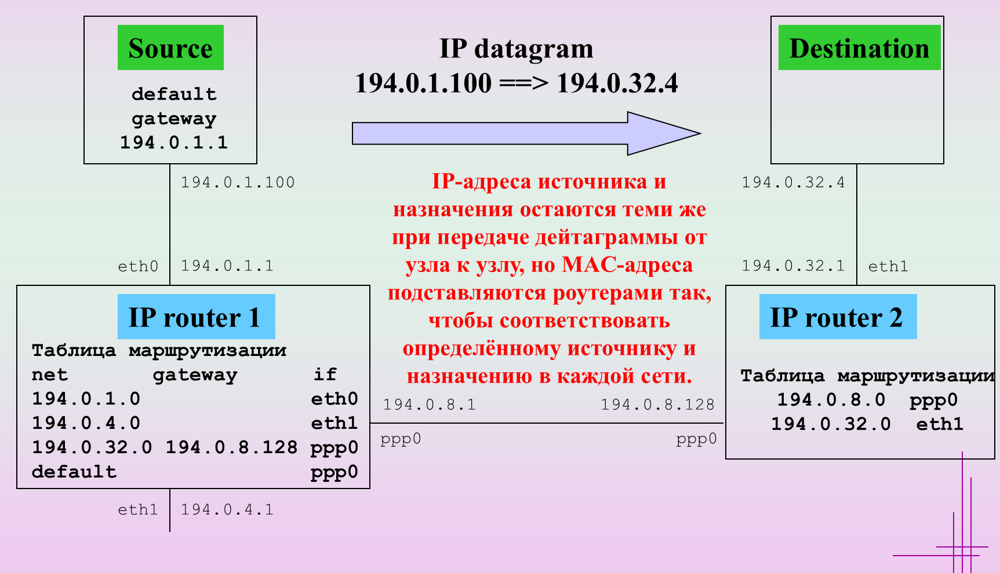
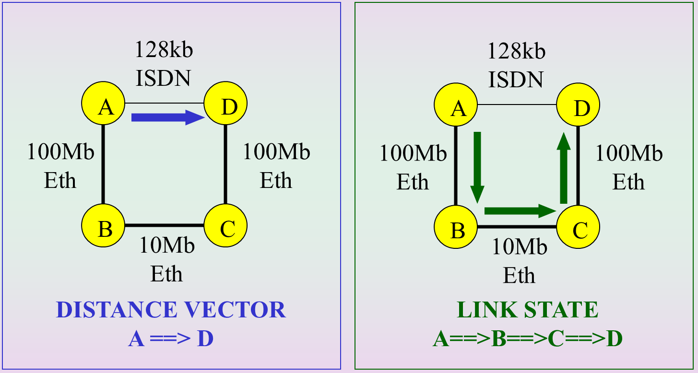
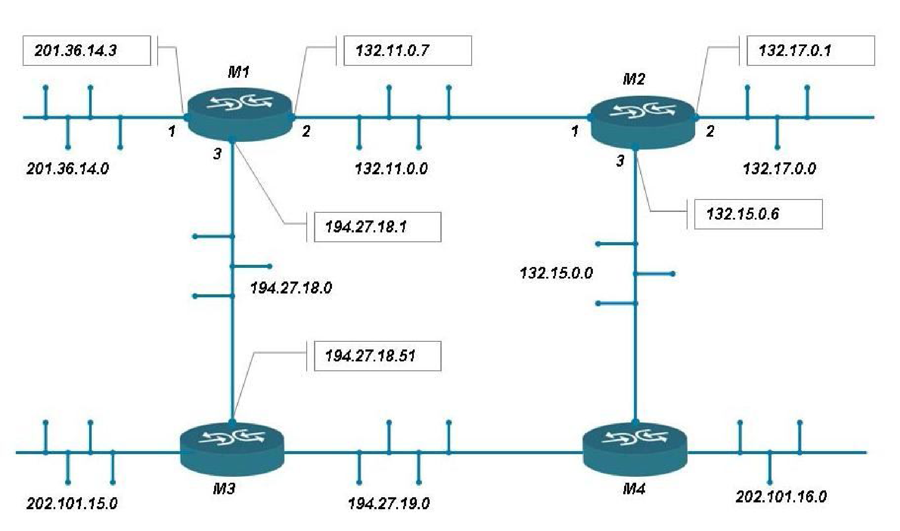
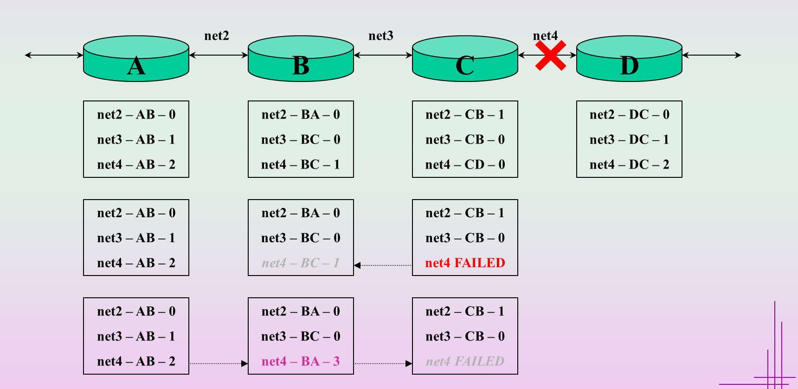
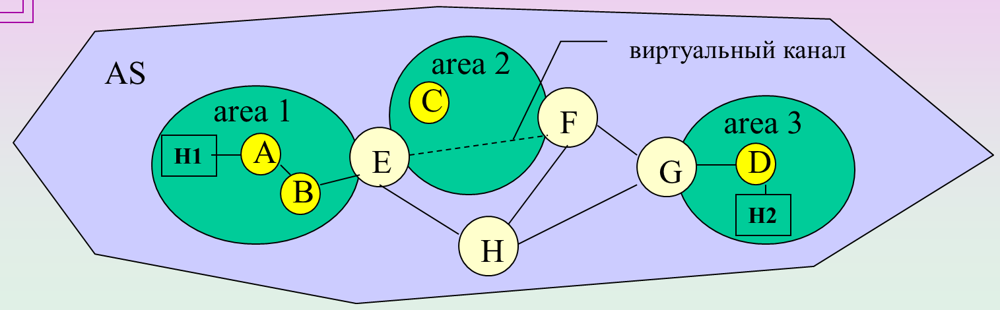
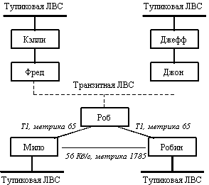
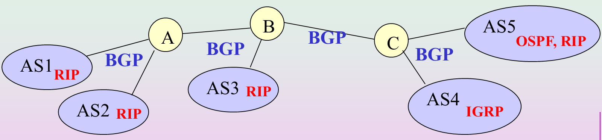

# Маршрутизация в сети Интернет

Источник: презентация «маршрут».

## IP и фрагментация

- **IP** передаёт пакеты между сетями разных типов. Заголовок содержит адреса отправителя и получателя, длину пакета, время жизни (TTL) и другие поля.
- Если IPv4-пакет превышает допустимый размер для сети, его можно разделить на фрагменты. Узел назначения собирает исходный пакет.

## Маршрут и таблица маршрутизации

**Маршрутизация** — выбор пути доставки пакета к получателю. Маршрутизатор знает доступные сети и выбирает следующий узел по таблице маршрутизации.

В схеме со слайда 4 между компьютерами А и Б показаны два пути: через маршрутизаторы 1–3 или 1–2–3.

Запись таблицы содержит сеть назначения, шлюз, выходной интерфейс и метрику. **Маршрут по умолчанию** используют, если более подходящей записи нет. В Windows таблицу просматривают командой `route print`.

При обычной передаче без NAT IP-адреса отправителя и получателя сохраняются. В каждом Ethernet-сегменте маршрутизатор формирует кадр с MAC-адресами для этого участка пути.

## Статическая и динамическая маршрутизация

| Вид | Как появляются маршруты | Особенности |
| --- | --- | --- |
| Статическая | Администратор вводит записи вручную | Нет обмена маршрутными обновлениями. При изменении сети настройки приходится менять вручную |
| Динамическая | Маршрутизаторы обмениваются информацией по протоколу маршрутизации | Маршруты подстраиваются под изменения сети. Обмен требует ресурсов процессора и канала |

Алгоритмы построения таблиц бывают фиксированными, простыми (случайная, лавинная маршрутизация, по предыдущему опыту) и адаптивными.

## Вектор расстояния и состояние каналов

- **Distance Vector:** маршрутизатор получает сведения об удалённых сетях от соседей. RIP выбирает путь по числу переходов (hop).
- **Link State:** маршрутизаторы распространяют сведения о своих связях, строят базу топологии и рассчитывают кратчайшие пути. Примеры: OSPF и IS-IS.

В примере путь A–D содержит меньше переходов, но канал ISDN медленнее Ethernet. Учёт стоимости связей позволяет выбрать путь A–B–C–D.

## Автономные системы

**Автономная система (AS)** — группа IP-сетей и маршрутизаторов с общей политикой маршрутизации.

- **Stub AS:** одно подключение к внешней AS.
- **Multihomed AS:** несколько внешних подключений.
- **Transit AS:** пропускает транзитный трафик других сетей.

**IGP** работают внутри AS: RIP, IGRP, OSPF, IS-IS. **EGP** связывают разные AS. Основной рассматриваемый протокол межсистемной маршрутизации — BGP.

## RIP и IGRP

**RIP** обменивается маршрутной информацией с соседями. Полученный через соседа маршрут становится на один переход длиннее. Максимум — 15 переходов, метрика 16 означает недоступную сеть.

В примере со слайда 15 маршрутизатор M1 сообщает соседям M2 и M3 о своих сетях. После обмена в таблице появляются удалённые сети с большей метрикой.

Медленное согласование таблиц может вызвать петли и «счёт до бесконечности».

Для уменьшения этой проблемы применяют:

- **Split horizon:** сведения о маршруте не отправляют обратно соседу, от которого их получили.
- **Hold down:** временно ограничивают принятие сомнительных обновлений.
- **Триггерные обновления:** сообщают об изменении маршрута, не ожидая очередной периодической рассылки.

**IGRP** — дистанционно-векторный протокол Cisco. Его составная метрика учитывает пропускную способность и задержку, а также может учитывать надёжность и загрузку каналов.

## OSPF

**OSPF** — протокол состояния связей. Маршрутизаторы обмениваются объявлениями LSA и по алгоритму Дейкстры строят дерево кратчайших путей.

AS можно разделить на области. Внутри области маршрутизаторы имеют одинаковую базу топологии. Области соединяет магистраль **area 0**, а пограничные маршрутизаторы **ABR** связывают области с магистралью.

В общем сетевом сегменте выбирают **DR** и резервный **BDR**, чтобы сократить обмен служебной информацией. При отказе DR его роль принимает BDR.

OSPF поддерживает разные маски подсетей, аутентификацию и несколько равных по стоимости маршрутов. Для обмена используются multicast-адреса `224.0.0.5` и `224.0.0.6`. Протокол работает непосредственно поверх IP.

## BGP

**BGP** передаёт информацию о доступных сетях между AS через TCP, порт 179.

BGP хранит путь через автономные системы (**AS_PATH**) и передаёт изменения маршрутов. Выбор пути учитывает политику, в том числе `local preference`, и длину AS_PATH. Кратчайший путь по числу AS выбирают с учётом других атрибутов. [Уточнение выбора пути: Cisco](https://www.cisco.com/c/en/us/support/docs/ip/border-gateway-protocol-bgp/13753-25.html).

