# Маршрутизация в информационных сетях

Источник: презентация «маршрут циско».

## Работа маршрутизатора

Маршрутизация включает **определение маршрута** и **пересылку пакета**. Таблица маршрутизации показывает, через какой интерфейс и следующий узел отправить пакет.

При пересылке маршрутизатор проверяет IP-адрес назначения и формирует кадр для следующего участка пути. Если подходящего маршрута нет, пакет не удаётся доставить.

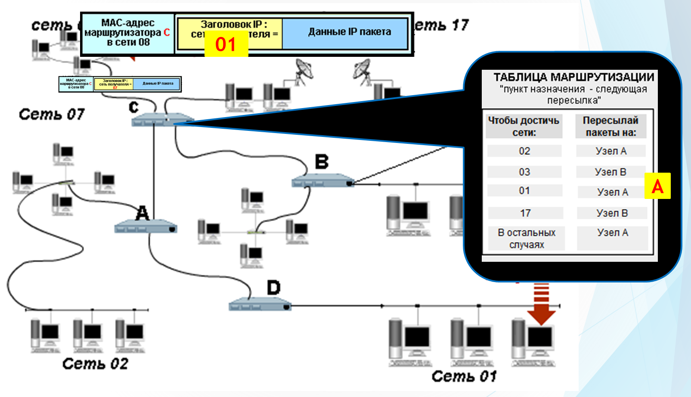

От алгоритмов маршрутизации требуют оптимального выбора пути, простоты, устойчивости, быстрой сходимости и гибкости. **Сходимость** — согласование сведений о маршрутах после изменения сети.

Алгоритмы бывают статическими и динамическими, одно- и многомаршрутными, плоскими и иерархическими, внутридоменными и междоменными. Метрики могут учитывать число переходов, надёжность, задержку и пропускную способность.

## Таблица маршрутизации

| Поле | Значение |
| --- | --- |
| Сеть или узел назначения | Куда ведёт маршрут |
| Маска | Размер сети. Маска `/32` обозначает отдельный узел |
| Шлюз | Адрес следующего маршрутизатора |
| Интерфейс | Через какой интерфейс отправлять пакет |
| Метрика | Числовая оценка пути |

Записи появляются из непосредственно подключённых сетей, статических настроек, протоколов маршрутизации и адресов специального назначения. Бывают маршруты к узлу, сети, по умолчанию, обратному адресу, для широковещательной и многоадресной передачи.

Проверяют наиболее точный маршрут к узлу или сети, затем маршрут по умолчанию. Если подходящей записи нет, возникает ошибка доставки.

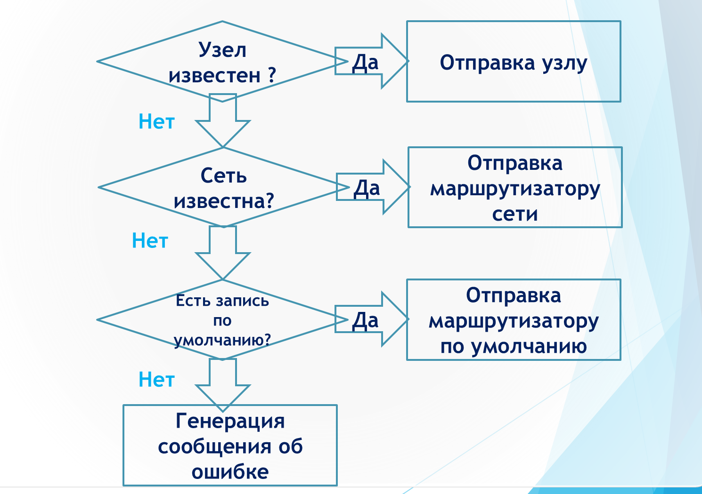

## Команды Windows и записи Unix

В Windows таблицу просматривают и изменяют командой `route`:

```text
route print
route print -4
route add 157.0.0.0 mask 255.0.0.0 157.55.80.1 metric 3 if 2
route change 157.0.0.0 mask 255.0.0.0 157.55.80.5 metric 2 if 2
route delete 157.0.0.0
```

Параметр `-p` при добавлении сохраняет маршрут после перезагрузки. `-4` выбирает IPv4, `-6` — IPv6.

В таблице Unix флаг **U** означает активный маршрут, **H** — маршрут к отдельному узлу, **G** — передачу через шлюз, **D** — получение маршрута из ICMP Redirect. Поле **Use** показывает число переданных пакетов.

## Статическая маршрутизация Cisco

Администратор задаёт сеть назначения, маску и адрес следующего маршрутизатора. Пример маршрута из презентации:

```text
enable
configure terminal
ip route 192.168.3.0 255.255.255.0 10.0.1.4
end
write memory
show ip route
```

Маршрут по умолчанию задают для сети `0.0.0.0` с маской `0.0.0.0`.

На схеме со слайда 23 пять маршрутизаторов Cisco 1841, коммутатор 2950-24 и четыре компьютера. Router0 связан с Router1 сетью `10.0.0.0/24`. Router1, Router2, Router3 и Router4 соединены через Switch0 сетью `10.0.1.0/24`.

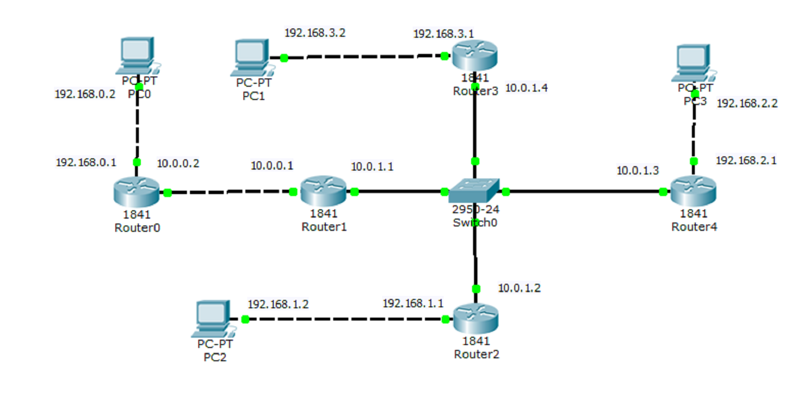

Адреса локальных сетей по схеме:

| Компьютер | IP-адрес | Маршрутизатор | IP-адрес маршрутизатора в локальной сети |
| --- | --- | --- | --- |
| PC0 | 192.168.0.2 | Router0 | 192.168.0.1 |
| PC1 | 192.168.3.2 | Router3 | 192.168.3.1 |
| PC2 | 192.168.1.2 | Router2 | 192.168.1.1 |
| PC3 | 192.168.2.2 | Router4 | 192.168.2.1 |

В Packet Tracer маршрут можно добавить через **Config → Routing → Static**: поля **Network**, **Mask**, **Next Hop**.

На слайде 24 в Router0 добавлен маршрут по умолчанию через `10.0.0.2`.


На слайде 26 у Router1 заданы маршруты к сетям `192.168.0.0/24`, `192.168.1.0/24`, `192.168.2.0/24`, `192.168.3.0/24` и маршрут по умолчанию.


> В исходных слайдах есть расхождение: на топологии адрес `10.0.0.2` подписан у Router0, а `10.0.0.1` — у Router1. В примерах настроек и таблиц эти адреса используются наоборот. При повторении примера нужно согласовать адреса интерфейсов и следующий узел.

## Динамическая маршрутизация и RIP

**IGP** определяют маршруты внутри AS, **EGP** — между AS. Динамические протоколы обновляют сведения при изменении сети.

**RIP** использует алгоритм Беллмана–Форда и метрику числа переходов. Обновления отправляются примерно каждые 30 секунд через UDP, порт 520. После трёх минут без обновлений маршрут считают недоступным. Метрика 16 обозначает недоступность, поэтому RIP подходит для небольших сетей.

**RIPv2** передаёт дополнительную информацию о маршрутах и поддерживает аутентификацию.

На схеме со слайда 35 пять маршрутизаторов Cisco 1841, три концентратора Hub-PT и четыре компьютера. Router1 и Router2 соединяют левые сети с общим сегментом. Router3 и Router4 ведут к PC4 через Hub2. Router5 подключает PC3.

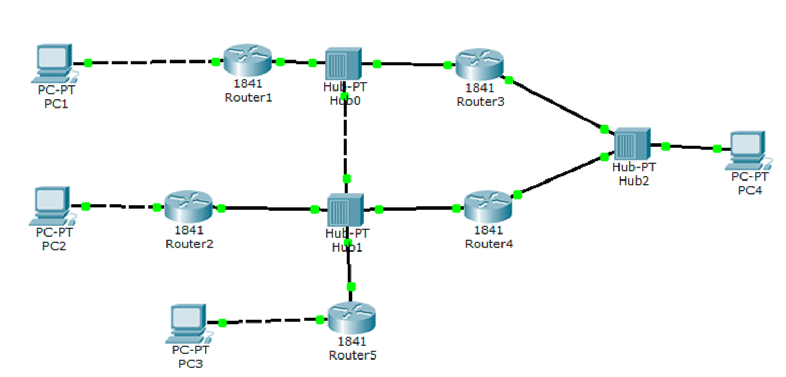

Пример настройки Router1 с сетями из его таблицы:

```text
enable
configure terminal
router rip
network 10.0.0.0
network 192.168.1.0
version 2
end
write memory
show ip route
```

На каждом маршрутизаторе указывают его непосредственно подключённые сети. В таблице Router1 подключены сети `10.0.0.0/24` и `192.168.1.0/24`, а удалённые маршруты помечены буквой **R**.


В режиме Simulation на слайде 37 показаны IP- и UDP-заголовки пакета RIP, маршрутная информация и метрика.

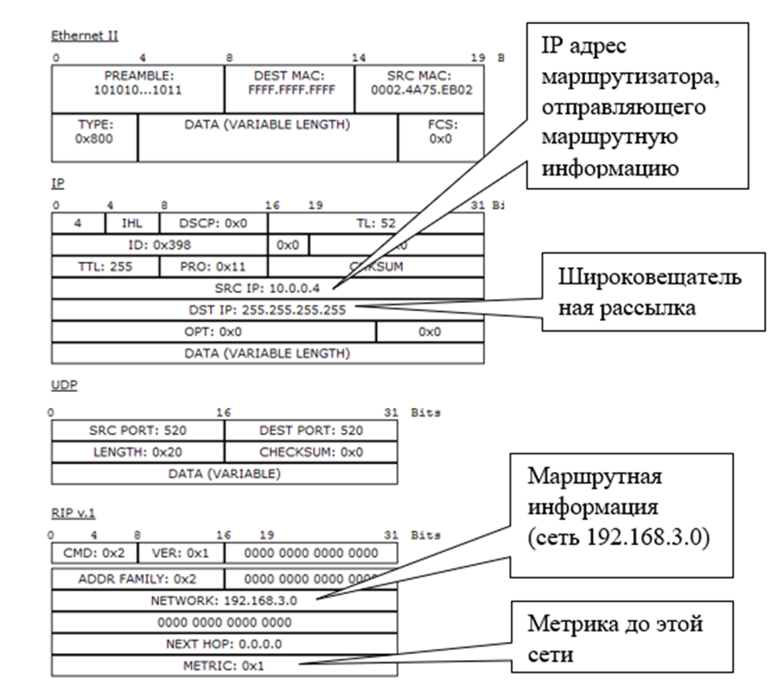

### Пример RIP на общей топологии

На слайдах 40, 44 и 51 примеры RIP, OSPF и BGP используют одну топологию с несколькими маршрутизаторами, коммутаторами и компьютерами. Для каждого протокола показана своя таблица маршрутизации R3.

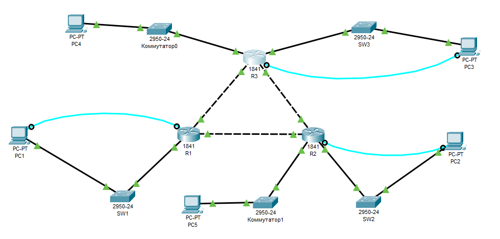

В примере RIP со слайда 40 удалённые маршруты обозначены **R**.


## Выбор маршрута Cisco

- При пересылке пакета выбирают совпадающий маршрут с **самым длинным префиксом**.
- Для одинакового префикса **административная дистанция (AD)** определяет доверие к источнику: меньшее значение предпочтительнее.
- Для путей одного протокола сравнивают **метрику**.

| Источник | AD | Код в таблице |
| --- | ---: | --- |
| Подключённая сеть | 0 | C |
| Статический маршрут | 1 | S |
| IGRP | 100 | I |
| OSPF | 110 | O |
| RIP | 120 | R |

Запись `R 192.168.2.0/24 [120/1] via 10.0.0.2` означает маршрут RIP с AD 120, метрикой 1 и следующим узлом `10.0.0.2`. Обозначение **S*** используют для статического маршрута по умолчанию.

## OSPF и алгоритм Дейкстры

**OSPF** — внутренний протокол состояния связей. Он строит дерево кратчайших путей по алгоритму Дейкстры и обычно сходится быстрее RIP.

Алгоритм начинает с расстояния 0 до исходной вершины. Затем выбирает непосещённую вершину с минимальной меткой и уточняет расстояния до её соседей.

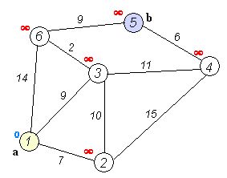

Пример настройки для сети `10.0.0.0/24`:

```text
enable
configure terminal
router ospf 1
network 10.0.0.0 0.0.0.255 area 1
end
write memory
show ip route
```

Здесь `1` после `router ospf` — локальный номер процесса, а `area 1` — область OSPF. Области связывает магистраль **area 0**.

> В команде со слайда исправлена маска: OSPF использует обратную маску `0.0.0.255` для сети /24. Номер процесса может различаться у соседей. [Настройка OSPF](https://www.cisco.com/c/en/us/td/docs/switches/lan/c9000/lyr3-fwd/ospf/ospf-configuration-guide/ospf.html), [номер процесса](https://www.cisco.com/c/en/us/support/docs/ip/open-shortest-path-first-ospf/13689-17.html).

OSPF поддерживает разные маски подсетей, равные по стоимости маршруты и multicast. Он работает поверх IP с номером протокола **89**. [Уточнение: Cisco](https://www.cisco.com/c/en/us/td/docs/ios-xml/ios/qos_nbar/prot_lib/config_library/pp5800/nbar-prot-pack5800/o.html).

На слайде 48 показаны две части пакета Link State Update: заголовки Ethernet/IP и объявления состояния связей.

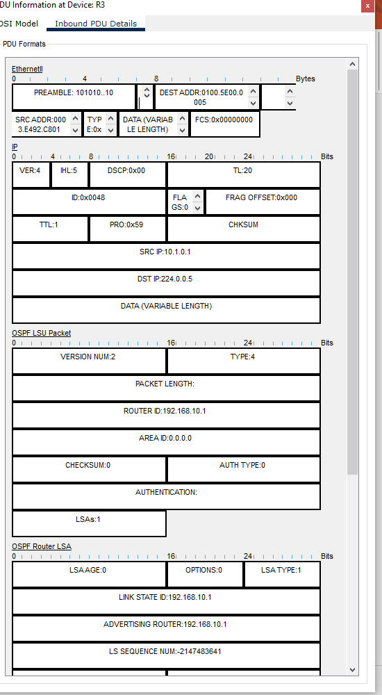

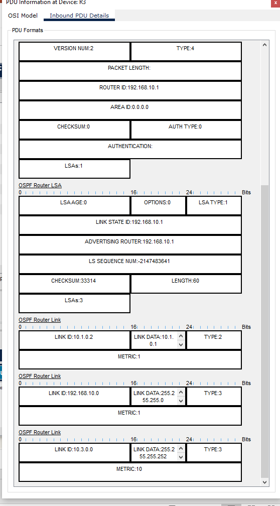

### Пример OSPF на общей топологии

На той же топологии в примере со слайда 44 удалённые маршруты R3 обозначены **O**.


## BGP

**BGP** обменивается сведениями о достижимости сетей между автономными системами через TCP, порт 179.

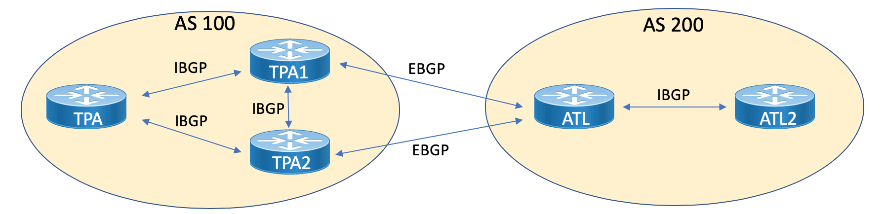

BGP использует путь через AS и атрибуты маршрута. На выбор влияют политика и `local preference`, затем другие условия, включая длину AS_PATH. Описание SPF на слайде 50 относится к OSPF. [Уточнение работы BGP: Cisco](https://www.cisco.com/c/en/us/support/docs/ip/border-gateway-protocol-bgp/13753-25.html).

В режиме Simulation на слайде 52 показаны сообщения OPEN и UPDATE.

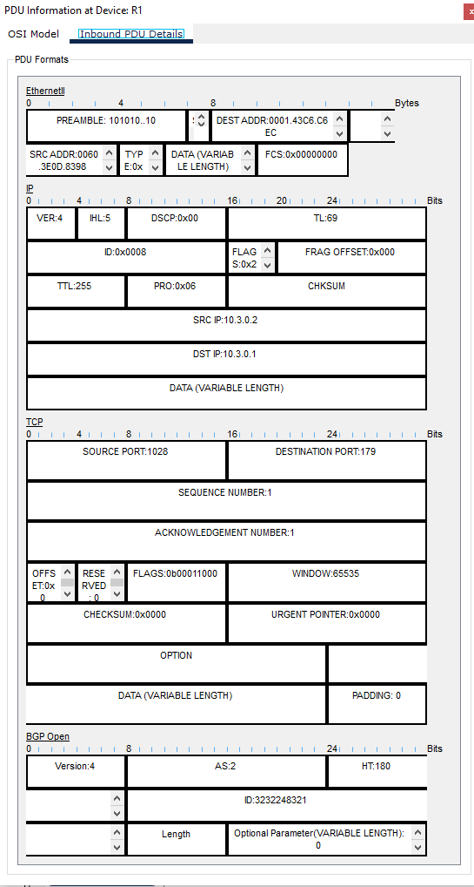


### Пример BGP на общей топологии

На той же топологии в примере со слайда 51 удалённые маршруты R3 обозначены **B**.

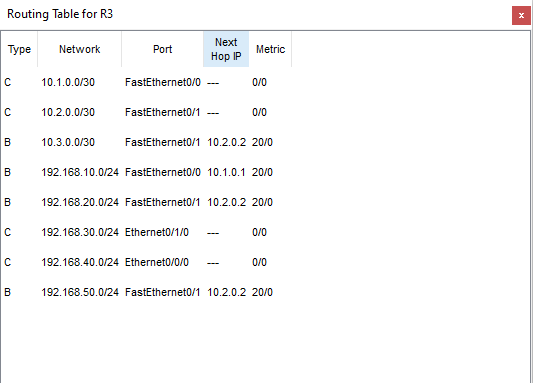

