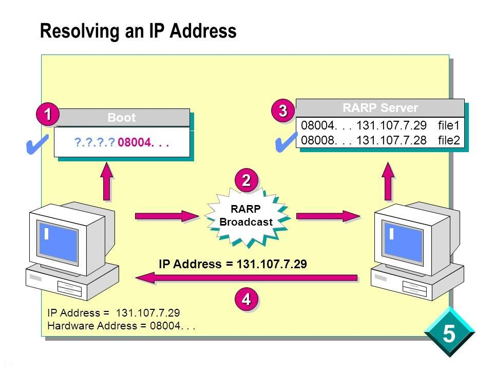
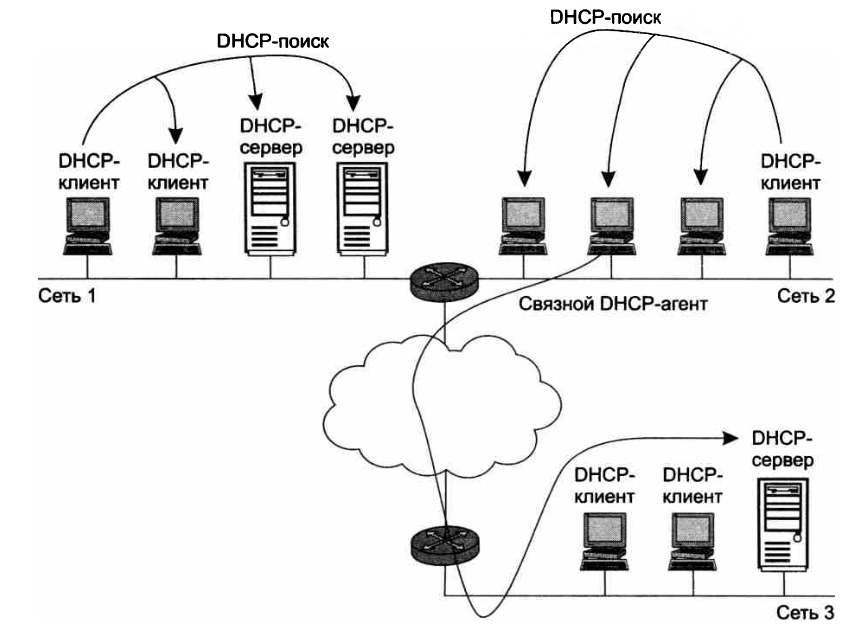

# Протокол DHCP

Источник: презентация «DHCP короткий».

## Назначение DHCP

**DHCP (Dynamic Host Configuration Protocol)** — протокол динамического конфигурирования хостов. Он автоматически назначает параметры сетевого интерфейса:

- IP-адрес и маску подсети;
- адрес шлюза по умолчанию;
- адрес DNS-сервера и другие параметры TCP/IP.

При ручной настройке администратор сам учитывает занятые и свободные адреса. DHCP автоматизирует эту работу и централизованно управляет распределением адресов.

## Предшественники DHCP

**RARP** определяет IP-адрес по MAC-адресу: клиент отправляет широковещательный запрос, сервер находит соответствие в своей базе и возвращает адрес. Требуется сервер в каждом сегменте и предварительная регистрация MAC-адресов. Дополнительные параметры передавать нельзя.

**BOOTP** создавался для бездисковых рабочих станций. Он передаёт IP-адрес, адрес TFTP-сервера и имя загрузочного файла. Поддерживает **relay** — посредника, который пересылает запросы серверу из других сетей. Недостатки: ручная настройка таблиц и ограниченный объём дополнительных данных.

DHCP — совместимое расширение BOOTP. DHCP-сервер обслуживает клиентов BOOTP, но обратная совместимость не предусмотрена.

## Режимы назначения адресов

DHCP работает по модели **клиент–сервер**. Администратор задаёт **пул адресов** — диапазон адресов, доступных для выдачи.

| Режим | Как назначается адрес |
| --- | --- |
| Ручное назначение статических адресов | Администратор закрепляет IP-адрес за MAC-адресом или другим идентификатором клиента. Сервер всегда выдаёт этому клиенту тот же адрес |
| Автоматическое назначение статических адресов | Сервер сам выбирает свободный адрес при первом запросе и закрепляет его за клиентом постоянно |
| Динамическое распределение | Сервер выдаёт адрес на ограниченный срок — **срок аренды**. Освободившиеся адреса можно выдать другим клиентам |

Динамический режим экономит адреса, если устройства подключаются в разное время. Пример из презентации: для 500 мобильных сотрудников, из которых обычно в офисе не более 50, достаточно пула из 64 адресов с запасом.

## DHCP-сервер и связной агент

Клиент начинает обмен широковещательным запросом. Сервер в той же подсети получает его непосредственно. Для надёжности можно установить резервный DHCP-сервер.

Если сервер находится в другой подсети, **связной DHCP-агент (relay)** пересылает ему запросы клиентов и возвращает ответы. Так один сервер обслуживает несколько сетей.

## Получение адреса

1. **DHCP-поиск.** Клиент отправляет широковещательное сообщение всем узлам своей IP-сети.
2. **DHCP-предложение.** Серверы отвечают, предлагая IP-адрес и параметры настройки. При необходимости обмен проходит через связного агента.
3. **DHCP-запрос.** Клиент выбирает предложение, обычно первое, и сообщает всем серверам о своём выборе.
4. **DHCP-квитанция.** Выбранный сервер подтверждает адрес и аренду. Остальные серверы отменяют свои предложения. Клиент получает подтверждение и начинает работу.

## Срок аренды

Администратор задаёт пул адресов и срок аренды. Для учебной сети срок может соответствовать длительности лабораторной работы, для корпоративной — составлять несколько дней или недель.

Клиент заранее пытается продлить аренду у выдавшего адрес сервера. Если ответа нет, повторяет запросы, затем обращается к другим серверам. Без продления после окончания аренды клиент теряет выданные параметры. Он также может досрочно отказаться от адреса.

## Ограничения динамических адресов

Изменение IP-адреса усложняет:

- сопоставление доменных имён и адресов в DNS;
- удалённое управление и сбор статистики;
- фильтрацию пакетов по IP-адресам.

**Динамическая DNS** согласует адресную информацию служб DHCP и DNS. Для маршрутизаторов, серверов, принтеров и устройств, используемых в мониторинге и фильтрации, обычно назначают постоянные адреса.
