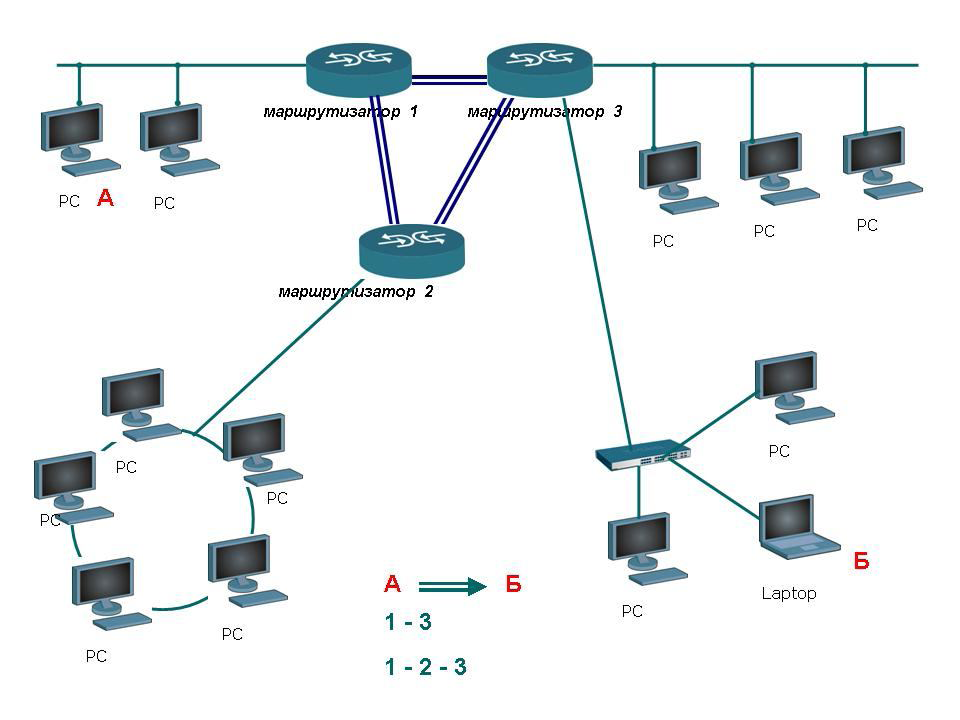
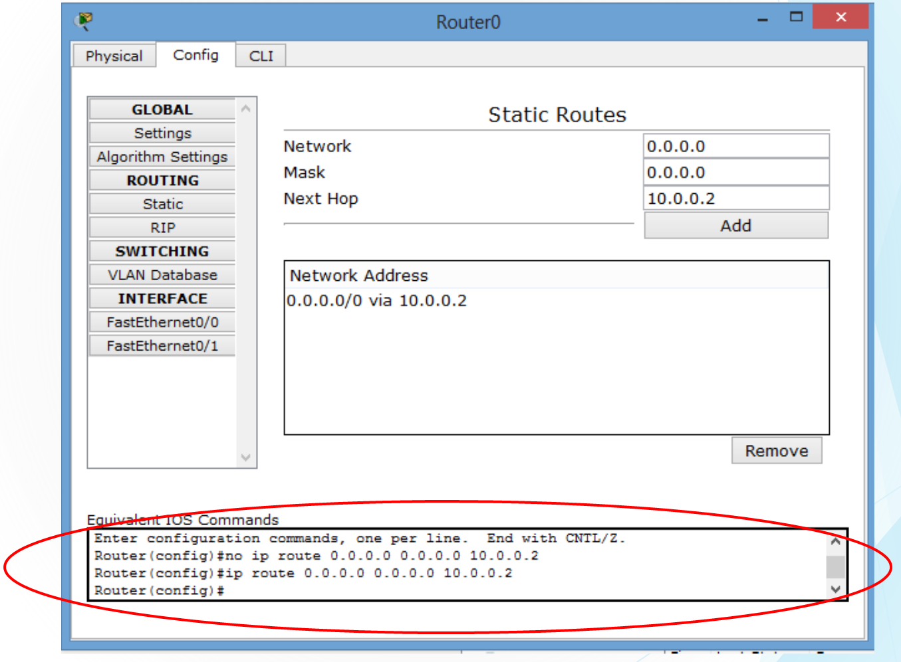
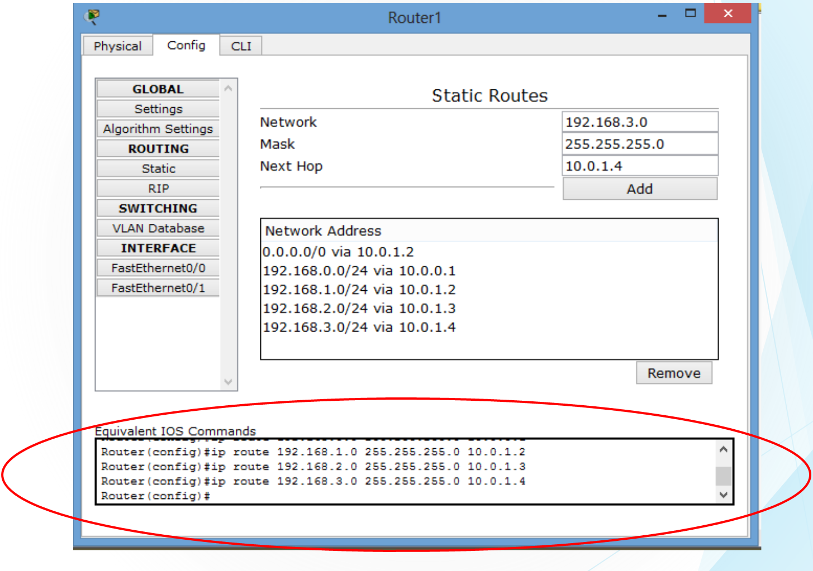
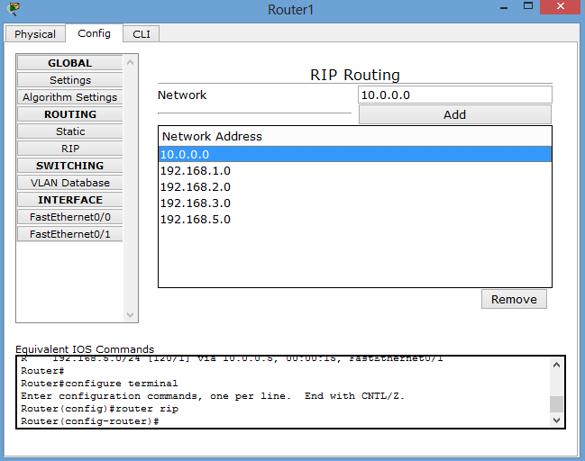
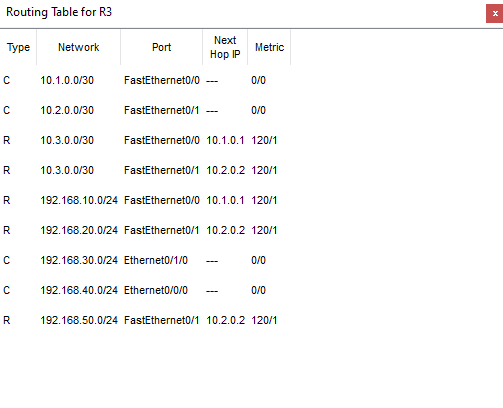
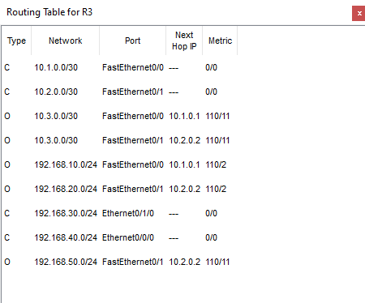
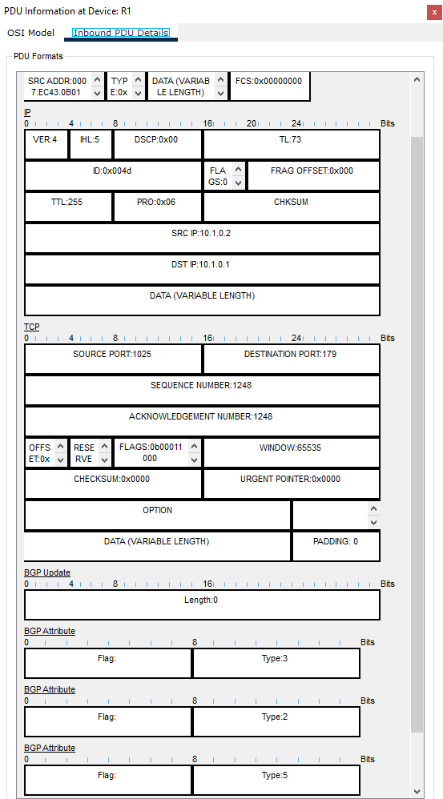

# Циско-схемы

Схемы и снимки из презентаций «маршрут» и «маршрут циско».

## Выбор пути между сетями

Источник: «маршрут», слайд 4.

Между компьютерами А и Б показаны два пути: через маршрутизаторы 1–3 или 1–2–3.

## Обмен маршрутами RIP

Источник: «маршрут», слайд 15.

Маршрутизатор M1 сообщает соседям M2 и M3 о своих сетях. После обмена в таблице появляются удалённые сети с большей метрикой.

## Статическая маршрутизация

Источник: «маршрут циско», слайды 23–27.

В сети пять маршрутизаторов Cisco 1841, коммутатор 2950-24 и четыре компьютера. Router0 связан с Router1 сетью `10.0.0.0/24`. Router1, Router2, Router3 и Router4 соединены через Switch0 сетью `10.0.1.0/24`.

Адреса локальных сетей по схеме:

| Компьютер | IP-адрес | Подключённый маршрутизатор | IP-адрес маршрутизатора в локальной сети |
| --- | --- | --- | --- |
| PC0 | 192.168.0.2 | Router0 | 192.168.0.1 |
| PC1 | 192.168.3.2 | Router3 | 192.168.3.1 |
| PC2 | 192.168.1.2 | Router2 | 192.168.1.1 |
| PC3 | 192.168.2.2 | Router4 | 192.168.2.1 |

На слайде 24 в Router0 добавлен маршрут по умолчанию через `10.0.0.2`.

На слайде 26 у Router1 заданы маршруты к сетям `192.168.0.0/24`, `192.168.1.0/24`, `192.168.2.0/24`, `192.168.3.0/24` и маршрут по умолчанию.

> В исходных слайдах есть расхождение: на топологии адрес `10.0.0.2` подписан у Router0, а `10.0.0.1` — у Router1. В примерах настроек и таблиц эти адреса используются наоборот. При повторении примера нужно согласовать адреса интерфейсов и следующий узел.

## Сеть для настройки RIP

Источник: «маршрут циско», слайды 35–39.

На схеме пять маршрутизаторов Cisco 1841, три концентратора Hub-PT и четыре компьютера. Router1 и Router2 соединяют левые сети с общим сегментом. Router3 и Router4 ведут к PC4 через Hub2. Router5 подключает PC3.

На слайде настройки показаны команды `router rip`, `network 10.0.0.0`, `version 2` и `write memory`. В таблице Router1 подключены сети `10.0.0.0/24` и `192.168.1.0/24`, а удалённые маршруты помечены буквой **R**.

## Примеры RIP, OSPF и BGP на общей топологии

Источник: «маршрут циско», слайды 40, 44 и 51.

В трёх примерах использовано одно изображение сети с несколькими маршрутизаторами, коммутаторами и компьютерами. На слайдах приведены разные таблицы маршрутизации R3.

### RIP

Источник: слайд 40. В таблице удалённые маршруты обозначены **R**.

### OSPF

Источник: слайд 44. В таблице удалённые маршруты обозначены **O**.

### BGP

Источник: слайд 51. В таблице удалённые маршруты обозначены **B**.

## Пакеты в режиме Simulation

### RIP

Источник: «маршрут циско», слайд 37. Снимок показывает IP- и UDP-заголовки, маршрутную информацию и метрику. Метрика 16 означает недоступный маршрут.

### OSPF

Источник: «маршрут циско», слайд 48. Приведены две части пакета Link State Update: заголовки Ethernet/IP и объявления состояния связей.

### BGP

Источник: «маршрут циско», слайд 52. Приведены снимки сообщений OPEN и UPDATE.

